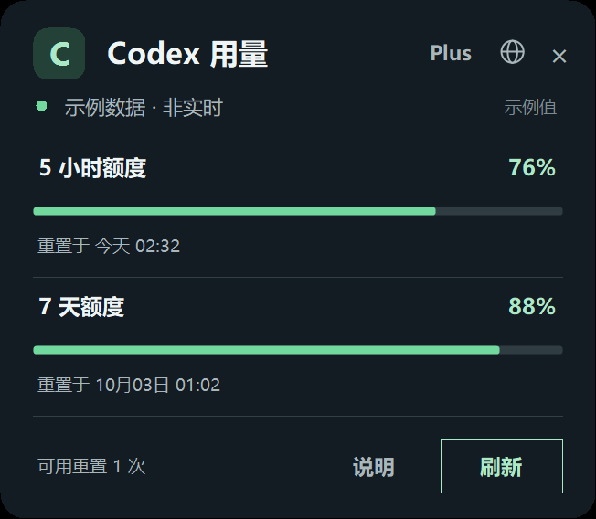

[English](README.md)

# Codex Usage Monitor

一款 Windows Codex CLI 使用量监控工具，在通知区域显示账户额度剩余比例和重置时间。支持 8 种界面语言及高 DPI 显示。

[**下载 Windows 版 — CodexUsageMonitor 0.1.0-alpha.1**](https://github.com/flymm004/codex-usage-monitor/releases/tag/v0.1.0-alpha.1) · [查看全部版本](https://github.com/flymm004/codex-usage-monitor/releases)

**快速开始：** 在页面的 **Assets** 中下载 `CodexUsageMonitor-0.1.0-alpha.1-win-x64.zip`，打开 ZIP 并点击 **全部解压**，然后进入解压后的文件夹，双击 `CodexUsageMonitor.exe` 即可运行，无需安装。使用前请先安装 Codex CLI 并登录。

> **当前为 Alpha 版本。** 项目依赖本机 Codex CLI App Server 返回的数据结构，Codex 更新后可能需要适配。

## 功能

- 显示服务返回的短周期、长周期剩余比例和重置时间
- 在通知区域图标上显示短周期剩余比例
- 每两分钟自动刷新，也支持手动刷新
- 支持英语、简体中文、繁体中文、日语、韩语、西班牙语、德语和法语
- 支持高 DPI 和 Per-Monitor V2 缩放

## 截图

托盘图标直接显示短周期剩余比例，点击后展开用量面板。截图使用示例数值，不包含真实账户额度。

<p align="center">
  
</p>

<p align="center">
  
</p>

## 运行条件

- Windows 10/11
- .NET Framework 4.8 或更新版本
- 已安装 Codex CLI，并使用 ChatGPT 账户登录。仅使用 API Key 的登录方式不提供这里显示的 ChatGPT 套餐额度。

## 下载运行

Release 同时提供 ZIP 和单独的 EXE/配置文件。推荐下载 ZIP：解压后运行 `CodexUsageMonitor.exe`。若单独下载 EXE，也要下载对应的 `.exe.config` 文件并放在 EXE 旁边；该配置用于启用高 DPI 显示适配。

初始版本尚未签名，Windows 可能显示 SmartScreen 提示。运行前可查看 Release 说明和 SHA-256 校验文件。

## 从源码构建

在 Windows PowerShell 5.1 或 PowerShell 7 中运行：

```powershell
.\build.ps1 -Version 0.1.0-alpha.1
```

脚本使用 Windows 自带的 .NET Framework C# 编译器，无需 NuGet 包。EXE、ZIP、独立下载文件和 SHA-256 校验文件会生成在已加入忽略列表的 `artifacts/` 目录下。推送 `v*` 标签后，GitHub Actions 会构建这些文件并创建待审核的 Draft Release。

## 数据与隐私

程序通过标准输入输出启动本机 `codex app-server`，调用 `account/read` 和 `account/rateLimits/read` 查询登录状态与额度。App Server 使用 Codex 已有的登录状态，并与 Codex 服务通信以读取账户额度，因此运行时需要联网。本程序不连接开发者自有服务器、不收集遥测，也不保存登录令牌；界面不会展示或保存账户邮箱。语言偏好保存在当前 Windows 用户的应用数据目录中。

显示值来自 Codex 服务的返回结果；本程序不会估算剩余任务次数。Codex CLI 更新可能更改 App Server 协议或额度字段。协议见[官方文档](https://learn.chatgpt.com/docs/app-server)。本项目是社区工具，与 OpenAI 无隶属关系；“Codex”用于说明兼容对象。

## 贡献

参阅 [CONTRIBUTING.md](CONTRIBUTING.md)。请勿在公开问题中上传包含实时额度、邮箱、令牌或其他私人信息的截图和日志。

## 许可证与关联

项目采用 [MIT 许可证](LICENSE)。本项目是独立社区工具，与 OpenAI 无隶属关系或背书；“Codex”仅用于标识兼容产品。
